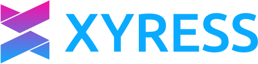

### Verifiable AI infrastructure

Xyress is a sovereign realm where humans, organizations, AI agents, and devices operate under unified identity, verifiable trust, and multi-model AI assistance. Built by [Ivalice](https://ivalice.com/).

**One identity. Everything connected. Every action provable.**

## The nine building blocks

Xyress is built as nine composable components — two foundations every application relies on, and seven applications on top.

| Tier | Component | What it does |
|---|---|---|
| Foundation | **Sigil** | One identity for every person, company, AI system, and device |
| Foundation | **Witness** | Every action that matters recorded as evidence anyone can check |
| Application | **Vigil** | Continuous, AI-assisted security built into the platform |
| Application | **Commons** | How systems open their doors to each other, under rules each sets |
| Application | **Synod** | Several AI models work on important decisions together |
| Application | **Nexa** | Modernize an existing system or bring a new one onto Xyress |
| Application | **Charter** | Any system on Xyress can issue its own tokens |
| Application | **Arbiter** | Ranks AI models on how they really perform |
| Application | **Retinue** | Platform-tuned AI agents that act within limits you set |

## Talk to the team

Investors, partners, builders, operators, and press: [xyress.com/partner](https://xyress.com/partner).

[Website](https://xyress.com) · [X](https://x.com/XyressOfficial) · [LinkedIn](https://linkedin.com/company/xyress)

